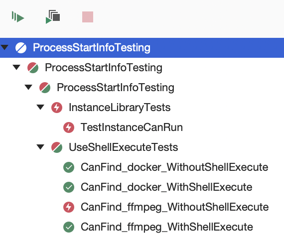

# ProcessStartInfoTesting

Documentation for [UseShellExecute](https://docs.microsoft.com/en-us/dotnet/api/system.diagnostics.processstartinfo.useshellexecute?view=net-5.0)
states that:

> When `UseShellExecute` is `false`, the `FileName` property can be either a fully qualified path to the
> executable, or a simple executable name that the system will attempt to find within folders specified
> by the `PATH` environment variable.

Some quick experiments with `ProcessStartInfo` with `UseShellExecute == false` give conflicting results on Mac OS, Big Sur:

* Some binaries, like `docker`, can be found and executed.
* Others, like `ffmpeg`, cannot.



In these examples, both appear on the `PATH`, as can be shown with:

```bash
which ffmpeg
which docker
echo $PATH
```

## Specifics

On my system:

```
which ffmpeg
/opt/homebrew/bin/ffmpeg
```

My path definitely contains an entry for `/opt/homebrew/bin`.

## Prerequisites

Install `docker` and `ffmpeg` with [Homebrew](https://brew.sh/), as here:

```bash
brew install ffmpeg
brew install --cask docker
```
